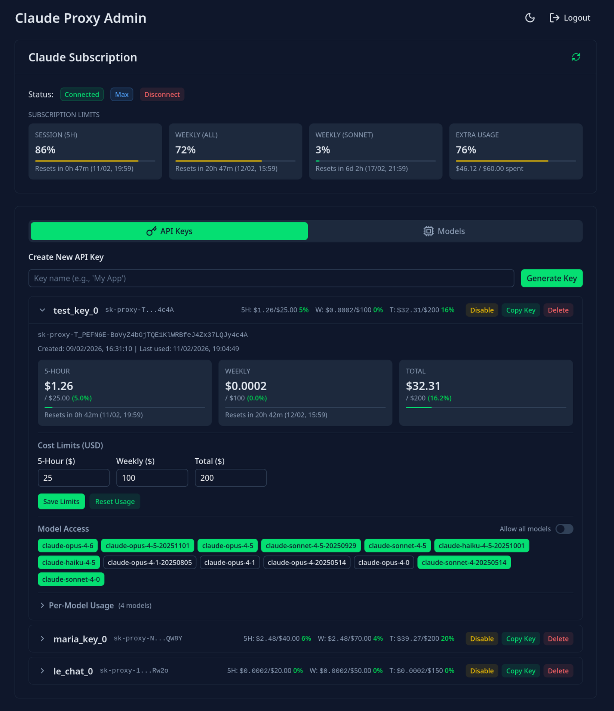
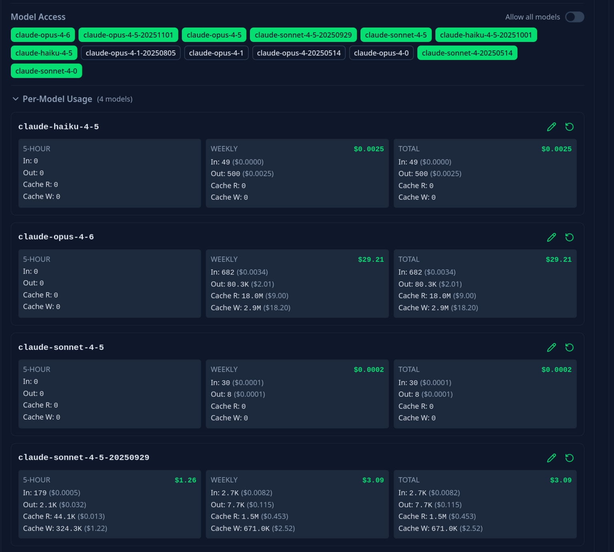
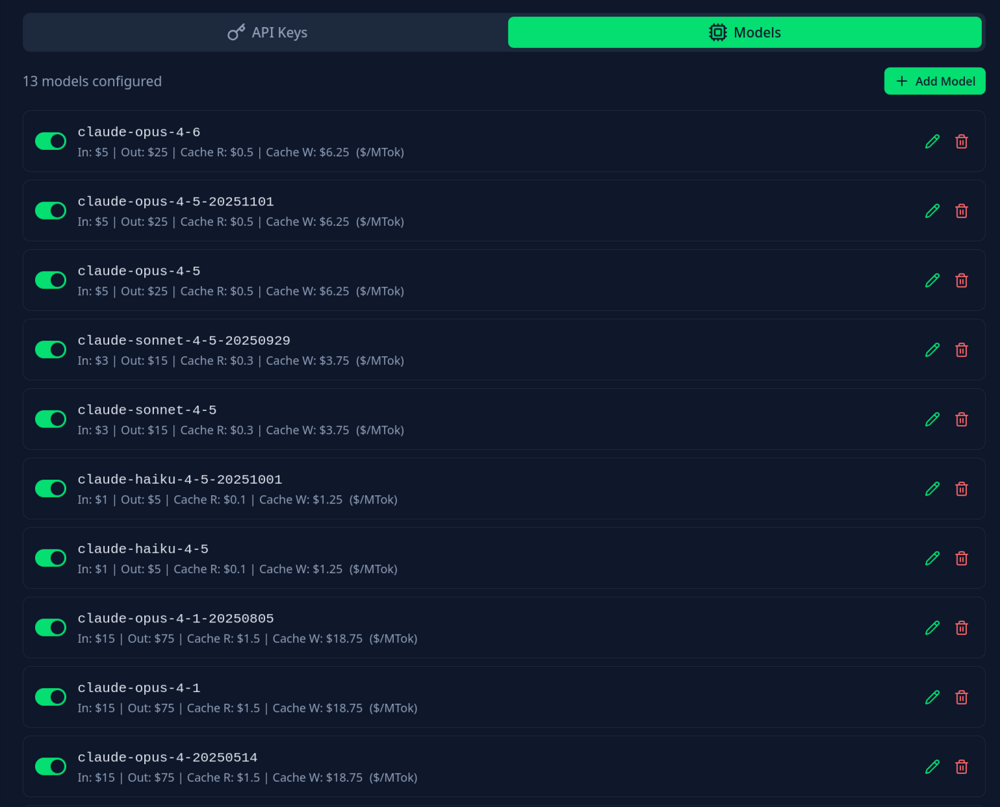

# claude-proxy-rs

Unified API proxy for Claude Pro/Max subscription.

Use your existing Claude Pro/Max subscription with AI coding assistants and tools that support either **OpenAI-compatible** or **Anthropic native** APIs, including [Cline](https://cline.bot/), [Roo Code](https://roocode.com/), [Kilo Code](https://kilo.ai/), and more.

## Admin UI







## Features

- **Dual API support:**
  - OpenAI-compatible API (`/v1/chat/completions`)
  - Anthropic native API (`/v1/messages`)
- OAuth authentication with Claude Pro/Max subscription
- Admin UI (Vue 3 SPA) for managing OAuth, API keys, models, and usage
- Streaming support with keep-alive pings (prevents timeouts during extended thinking)
- Tool/function calling
- Image inputs (base64)
- Extended thinking mode (configurable via model suffix or native API parameters)
- Automatic prompt caching (auto-injects cache breakpoints for tools, system, and conversation history)
- Token counting (`/v1/messages/count_tokens`)
- **Per-key cost-based rate limiting** (5-hour/weekly/total limits in USD, synced with subscription windows)
- **Per-key model access control** (allow all or whitelist specific models)
- **Per-model usage tracking** with cost calculation (input/output/cache pricing)
- **Usage history** — time-series charts for cost and tokens, breakdowns by model and API key (24h/7d/30d)
- **Dynamic model management** (add/remove models, configure per-token pricing)
- Key enable/disable toggle
- Configurable cloaking mode (`always`/`never`/`auto`)
- Single binary deployment (admin UI embedded via memory-serve)

## Quick Start

```bash
# Create .env with required admin credentials
cp .env.example .env
# Edit .env with your credentials

# Run
cargo run --release
```

Open http://127.0.0.1:4096/admin to:
1. Log in with your admin credentials
2. Connect your Claude account via OAuth
3. Generate API keys (`sk-proxy-*`)

### OpenAI-Compatible API

```python
from openai import OpenAI

client = OpenAI(
    base_url="http://127.0.0.1:4096/v1",
    api_key="sk-proxy-..."
)

response = client.chat.completions.create(
    model="claude-sonnet-4-5",
    messages=[{"role": "user", "content": "Hello!"}]
)
print(response.choices[0].message.content)
```

### Anthropic Native API

```python
from anthropic import Anthropic

client = Anthropic(
    base_url="http://127.0.0.1:4096",
    api_key="sk-proxy-..."
)

response = client.messages.create(
    model="claude-sonnet-4-5",
    max_tokens=1024,
    messages=[{"role": "user", "content": "Hello!"}]
)
print(response.content[0].text)
```

**Note:** Both APIs use the same `sk-proxy-*` API keys. Authentication can use either:
- `x-api-key: sk-proxy-...` header (standard Anthropic format)
- `Authorization: Bearer sk-proxy-...` header (alternative)

## IDE Extensions

### Cline / Roo Code / Kilo Code (Recommended)

Use the native **Anthropic** provider for the best experience:

| Setting | Value |
|---------|-------|
| API Provider | `Anthropic` |
| API Key | Your `sk-proxy-...` key |
| Use custom base URL | ✓ Enabled |
| Base URL | `http://127.0.0.1:4096` |
| Model | `claude-sonnet-4-5-20250929` (or any model) |

**Extended Thinking:** Enable via the extension's built-in checkbox and slider — no model suffixes needed. The proxy passes the thinking configuration through to Anthropic automatically.

### Alternative: OpenAI Compatible

If you prefer OpenAI-compatible mode (thinking via model suffix):

| Setting | Value |
|---------|-------|
| API Provider | `OpenAI Compatible` |
| Base URL | `http://127.0.0.1:4096/v1` |
| API Key | Your `sk-proxy-...` key |
| Model ID | `claude-sonnet-4-5(high)` |

**Extended Thinking suffixes** (OpenAI mode only):

The proxy automatically detects the model and applies the appropriate thinking mode:

**Opus 4.6** — Uses adaptive thinking with effort parameter:
| Suffix | Effort Level | Description |
|--------|--------------|-------------|
| `(low)` | `low` | Minimal thinking, fastest |
| `(medium)` | `medium` | Balanced thinking |
| `(high)` | `high` | Deep reasoning (default for complex tasks) |
| `(xhigh)` or `(max)` | `max` | Maximum thinking depth |

**Older models** (Sonnet 4.5, Opus 4.5, etc.) — Uses manual thinking with budget_tokens:
| Suffix | Budget Tokens |
|--------|---------------|
| `(low)` | 1,024 |
| `(medium)` | 8,192 |
| `(high)` | 32,000 |
| `(xhigh)` | 64,000 |
| `(16000)` | Custom value |

Examples:
- `claude-opus-4-6(high)` → adaptive thinking, effort=high
- `claude-sonnet-4-5(high)` → manual thinking, budget_tokens=32000

### Available Models

- `claude-opus-4-6` (latest, adaptive thinking, 128K output)
- `claude-opus-4-5`, `claude-sonnet-4-5`, `claude-haiku-4-5`
- `claude-opus-4-1`, `claude-opus-4-0`, `claude-sonnet-4-0`

## Configuration

Environment variables are loaded from `.env` file (via [dotenvy](https://crates.io/crates/dotenvy)) or from the environment.

| Env Variable | Default | Description |
|--------------|---------|-------------|
| `CLAUDE_PROXY_ADMIN_USERNAME` | *(required)* | Admin username for the login page |
| `CLAUDE_PROXY_ADMIN_PASSWORD` | *(required)* | Admin password for the login page |
| `CLAUDE_PROXY_HOST` | `127.0.0.1` | Bind address |
| `CLAUDE_PROXY_PORT` | `4096` | Port |
| `CLAUDE_PROXY_CORS_ORIGINS` | `localhost` | CORS: `localhost`, `*`, or comma-separated origins |
| `CLAUDE_PROXY_CLOAK_MODE` | `auto` | Cloaking mode: `always`, `never`, or `auto` (skip for Claude Code clients) |

Sessions are stored as HttpOnly cookies (24h expiry). Basic Auth is also accepted for programmatic access.

## API Endpoints

### OpenAI-Compatible
- `POST /v1/chat/completions` - Chat completions (streaming supported)
- `GET /v1/models` - List available models

**Response extensions beyond standard OpenAI spec:**

| Field | Location | Description |
|-------|----------|-------------|
| `reasoning_content` | `choices[].message` | Contains Claude's thinking/reasoning (similar to OpenAI o1's reasoning) |
| `cache_creation_input_tokens` | `usage` | Tokens written to Anthropic's prompt cache |
| `cache_read_input_tokens` | `usage` | Tokens read from prompt cache (cost savings) |

**Request extensions:**

| Field | Description |
|-------|-------------|
| `reasoning_effort` | Controls thinking depth: `low`, `medium`, `high`, `max` (alternative to model suffix) |

These fields are additive — standard OpenAI clients will ignore them, while clients that understand them can display thinking or track cache efficiency.

### Anthropic Native
- `POST /v1/messages` - Messages endpoint (streaming supported)
- `POST /v1/messages/count_tokens` - Count tokens for a message
- `GET /v1/models` - List available models (shared)

### Admin
- `GET /admin` - Admin UI (login page, OAuth management, API keys)
- `GET /admin/swagger` - Interactive API docs (Swagger UI)

### Health
- `GET /health` - Basic health check

## Data Storage

All data (OAuth credentials, API keys, usage counters) is stored in a [Turso](https://github.com/tursodatabase/turso) embedded database:
- **Linux**: `~/.local/share/claude-proxy/proxy.db`
- **macOS**: `~/Library/Application Support/claude-proxy/proxy.db`
- **Windows**: `%APPDATA%\claude-proxy\proxy.db`

## Development

### Requirements

- Rust 2024 edition (1.93.0+)
- [Bun](https://bun.sh/) >= 1.3.0
- [just](https://github.com/casey/just) command runner

### Running locally

```bash
just run                     # Start backend (cargo run)
```

For frontend hot reload, also run in a second terminal:
```bash
cd admin-ui && bun install && bun run dev
# Open http://localhost:5173/admin/
```

### Available recipes

```bash
just run                     # Run the proxy server
just check                   # Run all checks (fmt, clippy, tests, frontend)
just build                   # Build UI + release binary
just fmt                     # Format code
just lint                    # Lint (Rust + frontend)
just test                    # Run Rust tests
just openapi                 # Regenerate TypeScript client (backend must be running)
just deploy                  # Build and deploy to server
just logs                    # Tail server logs
just status                  # Check server status
just restart                 # Restart server
just test-api                # Run integration tests against running proxy
```


