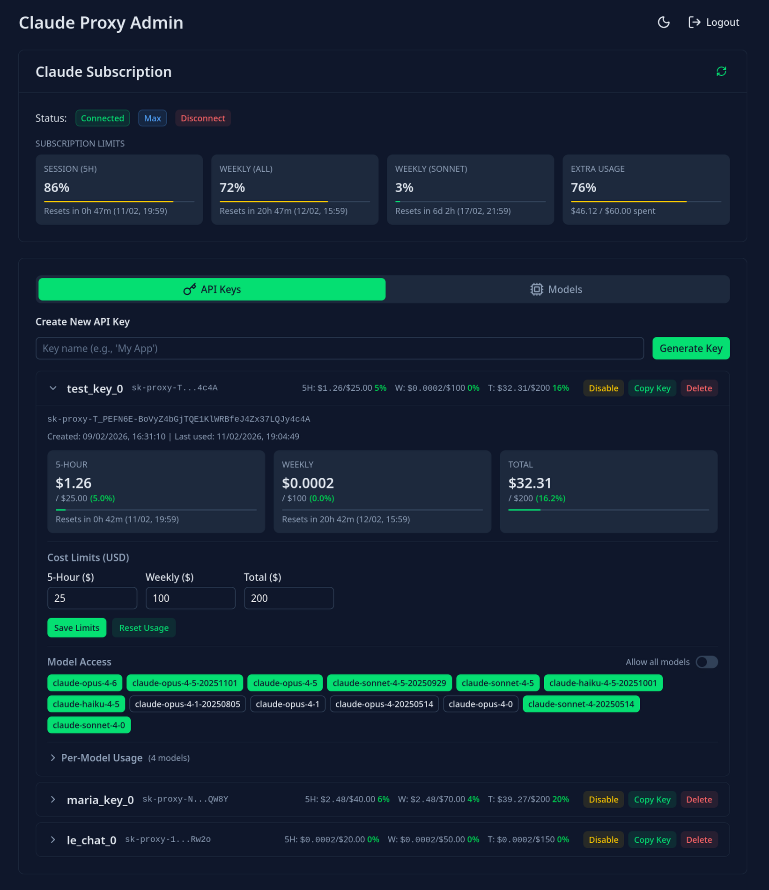
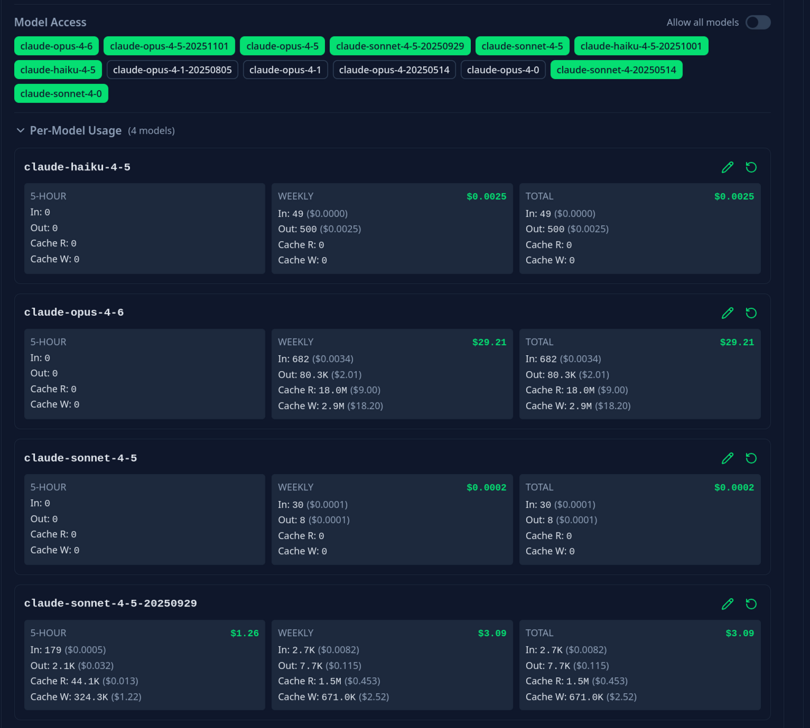
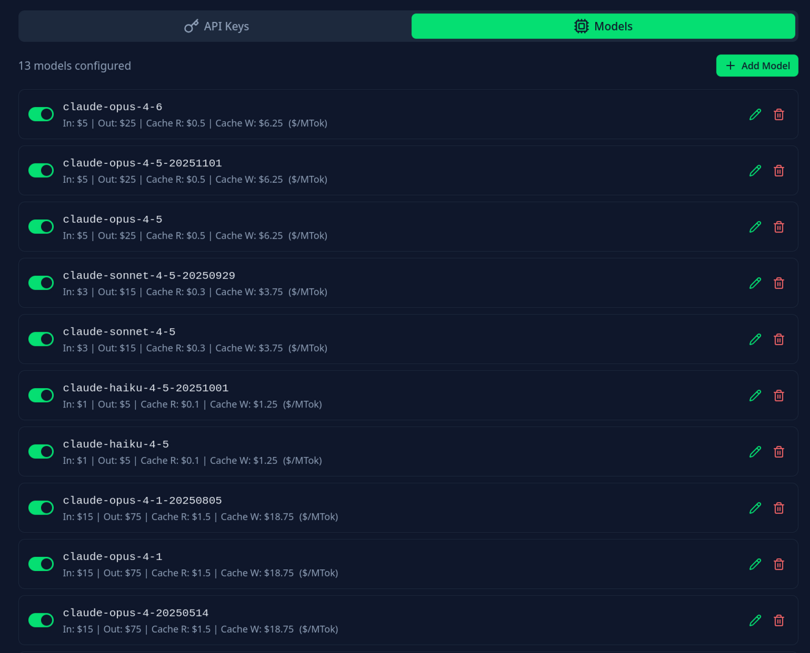

# claude-proxy-rs

Unified API proxy for Claude Pro/Max subscription.

Use your existing Claude Pro/Max subscription with AI coding assistants and tools that support either **OpenAI-compatible** or **Anthropic native** APIs, including [Cline](https://cline.bot/), [Roo Code](https://roocode.com/), [Kilo Code](https://kilo.ai/), and more.

## Admin UI

| Overview | API Keys | Models |
|:---:|:---:|:---:|
|  |  |  |

## Features

- **Dual API support:** OpenAI-compatible (`/v1/chat/completions`) and Anthropic native (`/v1/messages`)
- OAuth authentication with Claude Pro/Max subscription
- Admin UI (Vue 3 SPA) for managing OAuth, API keys, models, and usage
- Streaming support with keep-alive pings (prevents timeouts during extended thinking)
- Tool/function calling, image inputs (base64)
- Extended thinking mode (configurable via model suffix or native API parameters)
- Automatic prompt caching (auto-injects cache breakpoints for tools, system, and conversation history)
- Token counting (`/v1/messages/count_tokens`)
- **Per-key cost-based rate limiting** (5-hour/weekly/total limits in USD, synced with subscription windows)
- **Per-key model access control** (allow all or whitelist specific models)
- **Per-model usage tracking** with cost calculation (input/output/cache pricing)
- **Usage history** — time-series charts for cost and tokens, breakdowns by model and API key (24h/7d/30d)
- **User-facing usage dashboard** at `/admin/usage` — no admin auth required, authenticate with your `sk-proxy-*` key
- **Dynamic model management** (add/remove models, configure per-token pricing)
- Key enable/disable toggle
- Configurable cloaking mode (`always`/`never`/`auto`)
- Single binary deployment (admin UI embedded via memory-serve)

---

## Installation

### Requirements

- [Rust](https://www.rust-lang.org/) >= 1.94.0 (edition 2024)
- [Bun](https://bun.sh/) >= 1.3.0
- [Vite+](https://viteplus.dev/) (`vp` CLI) — unified frontend toolchain
- [just](https://github.com/casey/just) command runner

### Build & run

```bash
# Create .env with required admin credentials
cp .env.example .env
# Edit .env with your credentials

just build   # builds admin UI + release binary
just run     # or: cargo run
```

Open http://127.0.0.1:4096/admin, log in, connect your Claude account via OAuth, and generate API keys (`sk-proxy-*`).

### Configuration

Environment variables are loaded from `.env` or the environment.

| Variable | Default | Description |
|----------|---------|-------------|
| `CLAUDE_PROXY_ADMIN_USERNAME` | *(required)* | Admin username |
| `CLAUDE_PROXY_ADMIN_PASSWORD` | *(required)* | Admin password |
| `CLAUDE_PROXY_HOST` | `127.0.0.1` | Bind address |
| `CLAUDE_PROXY_PORT` | `4096` | Port |
| `CLAUDE_PROXY_CORS_ORIGINS` | `localhost` | CORS: `localhost`, `*`, or comma-separated origins |
| `CLAUDE_PROXY_CLOAK_MODE` | `auto` | Cloaking: `always`, `never`, `auto` (skips cloaking for Claude Code clients) |

Admin sessions use HttpOnly cookies with a 30-day sliding expiration. Basic Auth is also accepted.

### Data storage

All data (OAuth credentials, API keys, usage) is stored in a [Turso](https://github.com/tursodatabase/turso) embedded database:
- **Linux**: `~/.local/share/claude-proxy/proxy.db`
- **macOS**: `~/Library/Application Support/claude-proxy/proxy.db`
- **Windows**: `%APPDATA%\claude-proxy\proxy.db`

---

## Usage

### OpenAI-Compatible API

```python
from openai import OpenAI

client = OpenAI(base_url="http://127.0.0.1:4096/v1", api_key="sk-proxy-...")

response = client.chat.completions.create(
    model="claude-sonnet-4-6",
    messages=[{"role": "user", "content": "Hello!"}]
)
print(response.choices[0].message.content)
```

### Anthropic Native API

```python
from anthropic import Anthropic

client = Anthropic(base_url="http://127.0.0.1:4096", api_key="sk-proxy-...")

response = client.messages.create(
    model="claude-sonnet-4-6",
    max_tokens=1024,
    messages=[{"role": "user", "content": "Hello!"}]
)
print(response.content[0].text)
```

Both APIs accept `x-api-key: sk-proxy-...` or `Authorization: Bearer sk-proxy-...`.

### IDE Extensions

#### Cline / Roo Code / Kilo Code (Recommended)

Use the native **Anthropic** provider:

| Setting | Value |
|---------|-------|
| API Provider | `Anthropic` |
| API Key | Your `sk-proxy-...` key |
| Use custom base URL | ✓ Enabled |
| Base URL | `http://127.0.0.1:4096` |
| Model | `claude-sonnet-4-6` (or any model) |

Extended thinking works via the extension's built-in controls — no model suffixes needed.

#### Alternative: OpenAI Compatible

| Setting | Value |
|---------|-------|
| API Provider | `OpenAI Compatible` |
| Base URL | `http://127.0.0.1:4096/v1` |
| API Key | Your `sk-proxy-...` key |
| Model ID | `claude-sonnet-4-5(high)` |

**Extended thinking suffixes** (OpenAI mode only):

**Opus 4.6** — adaptive thinking with effort parameter:
| Suffix | Effort |
|--------|--------|
| `(low)` | `low` |
| `(medium)` | `medium` |
| `(high)` | `high` |
| `(xhigh)` / `(max)` | `max` |

**Older models** (Sonnet 4.5, Opus 4.5, etc.) — manual thinking with budget_tokens:
| Suffix | Budget Tokens |
|--------|---------------|
| `(low)` | 1,024 |
| `(medium)` | 8,192 |
| `(high)` | 32,000 |
| `(xhigh)` | 64,000 |
| `(16000)` | Custom value |

### Available Models

- `claude-opus-4-6`, `claude-sonnet-4-6` (latest, adaptive thinking)
- `claude-opus-4-5`, `claude-sonnet-4-5`, `claude-haiku-4-5`
- `claude-opus-4-1`, `claude-opus-4-0`, `claude-sonnet-4-0`

### API Endpoints

**OpenAI-Compatible**
- `POST /v1/chat/completions` — streaming supported
- `GET /v1/models`

Response extensions (ignored by standard clients):

| Field | Location | Description |
|-------|----------|-------------|
| `reasoning_content` | `choices[].message` | Extended thinking output |
| `cache_creation_input_tokens` | `usage` | Tokens written to prompt cache |
| `cache_read_input_tokens` | `usage` | Tokens read from prompt cache |

Request extensions:

| Field | Description |
|-------|-------------|
| `reasoning_effort` | `low`/`medium`/`high`/`max` — alternative to model suffix |

**Anthropic Native**
- `POST /v1/messages` — streaming supported
- `POST /v1/messages/count_tokens`
- `GET /v1/models`

**Admin**
- `GET /admin` — Admin UI
- `GET /admin/usage` — User-facing usage dashboard (Bearer key auth)

**Health**
- `GET /health`

---

## Development

```bash
just run                  # Start backend (cargo run)
```

For frontend hot reload, run in a second terminal:
```bash
cd admin-ui && vp install && vp dev
# Open http://localhost:5173/admin/
```

### Regenerating the API client

The TypeScript client in `admin-ui/src/client/` is auto-generated from the OpenAPI spec. After changing backend routes or types, regenerate it with:

```bash
just openapi   # dumps spec via --openapi flag (no running server needed), then regenerates client
```

### All recipes

```bash
just check    # fmt + clippy + tests + frontend checks
just build    # build UI + release binary
just fmt      # format Rust code
just lint     # clippy + frontend lint
just test     # Rust unit tests
just openapi  # regenerate TypeScript client
just deploy   # build + deploy to server
just logs     # tail server logs
just status   # server systemd status
just restart  # restart server service
just test-api # integration tests against running proxy
```
